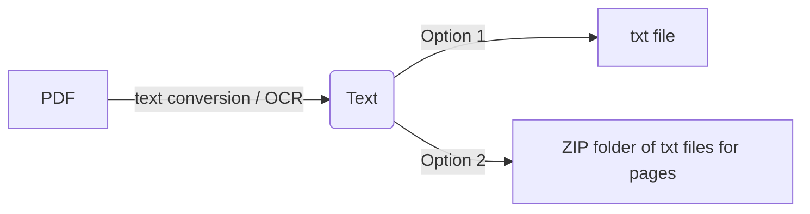

# PDF to Text

PDF text data extraction app that takes a PDF document as input and returns either a txt file that contains all pages or a compressed folder of txt files representing the document pages. OCR can also be enabled for scanned docoments.

## How does it worK?

```mermaid
flowchart LR

A[PDF] --> |text conversion / OCR| B(Text)
B --> |Option 1| D[txt file]
B --> |Option 2| E[ZIP folder of txt files for pages]

```
1. Upload your PDF.
2. Enable OCR (for scanned documents).
3. Select the PDF language.
4. Download your output file (zip/txt).

## How to support the project
You can help support the project through feedback and/or [buy me coffee](https://www.buymeacoffee.com/nainiayoub).

